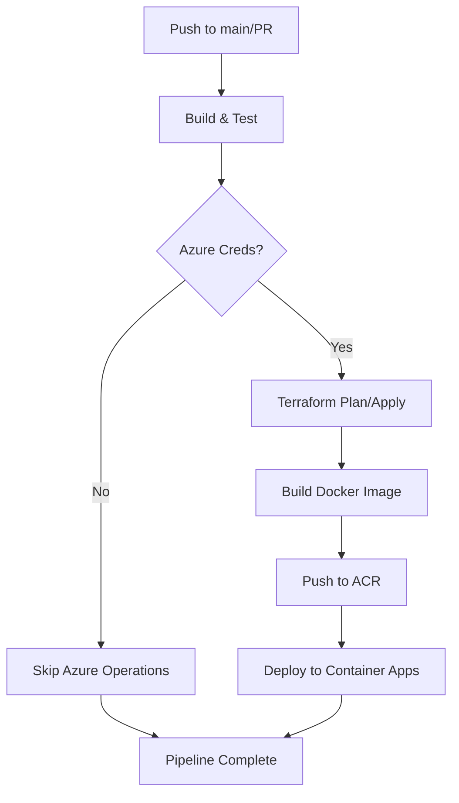

# GitHub Actions Secrets Configuration

This document explains how to configure the required secrets for the TodoList CI/CD pipeline to work with Azure.

## Required Secrets

To enable full Azure deployment functionality, configure the following secrets in your GitHub repository:

### 1. Azure Service Principal Credentials

**Secret Name:** `AZURE_CREDENTIALS`

**Value:** JSON containing Azure service principal credentials
```json
{
  "clientId": "your-client-id",
  "clientSecret": "your-client-secret", 
  "subscriptionId": "your-subscription-id",
  "tenantId": "your-tenant-id"
}
```

**How to create:**
1. Create a service principal in Azure:
   ```bash
   az ad sp create-for-rbac --name "github-actions-todolist" \
     --role contributor \
     --scopes /subscriptions/{subscription-id} \
     --sdk-auth
   ```
2. Copy the JSON output and paste it as the secret value

### 2. Terraform State Backend (Optional)

These secrets are optional. If not provided, Terraform will use local state:

**Secret Name:** `TERRAFORM_STATE_RESOURCE_GROUP`
**Value:** Resource group name for Terraform state storage account

**Secret Name:** `TERRAFORM_STATE_STORAGE_ACCOUNT`  
**Value:** Storage account name for Terraform state

**Secret Name:** `TERRAFORM_STATE_CONTAINER`
**Value:** Storage container name for Terraform state (usually "tfstate")

**How to create Terraform backend:**
```bash
# Create resource group
az group create --name "rg-terraform-state" --location "East US"

# Create storage account
az storage account create \
  --name "stterraformstate$(date +%s)" \
  --resource-group "rg-terraform-state" \
  --location "East US" \
  --sku "Standard_LRS"

# Create container
az storage container create \
  --name "tfstate" \
  --account-name "your-storage-account-name"
```

## Pipeline Behavior

### With All Secrets Configured
- ✅ Full CI/CD pipeline runs
- ✅ Terraform plan on PR
- ✅ Terraform apply on main branch
- ✅ Docker build and push to ACR
- ✅ Azure Container Apps deployment
- ✅ Remote Terraform state storage

### With Only AZURE_CREDENTIALS
- ✅ Build and test application
- ✅ Docker build and push to ACR  
- ✅ Azure Container Apps deployment
- ⚠️ Terraform uses local state (not persistent)

### Without Azure Secrets
- ✅ Build and test application
- ❌ Azure operations skipped
- ❌ No deployment to Azure

## Setting Up Secrets

1. Go to your GitHub repository
2. Navigate to **Settings** → **Secrets and variables** → **Actions**
3. Click **New repository secret**
4. Add each secret with the exact name and value

## Testing the Pipeline

1. **Trigger a build:** Push to main branch or create a PR
2. **Check Actions tab:** Monitor pipeline execution
3. **Review logs:** Look for "Azure credentials found" or "Azure credentials not configured" messages

## Troubleshooting

### Common Issues

1. **"Azure credentials not configured"**
   - Verify `AZURE_CREDENTIALS` secret exists and is valid JSON
   - Check service principal has correct permissions

2. **"Terraform backend initialization failed"**
   - Verify Terraform state secrets are correct
   - Ensure storage account and container exist
   - Check service principal has access to storage account

3. **"Container registry access denied"**
   - Verify service principal has ACR push permissions
   - Check if ACR exists or needs to be created by Terraform

### Manual Verification

Test your service principal credentials:
```bash
# Login using service principal
az login --service-principal \
  --username "your-client-id" \
  --password "your-client-secret" \
  --tenant "your-tenant-id"

# Verify access
az account show
az group list
```

## Security Best Practices

1. **Rotate secrets regularly** (every 90 days)
2. **Use least privilege** for service principal
3. **Monitor secret usage** in Actions logs
4. **Delete unused secrets** immediately

## Pipeline Workflow Summary



The pipeline is designed to be flexible and will adapt based on available configuration.
