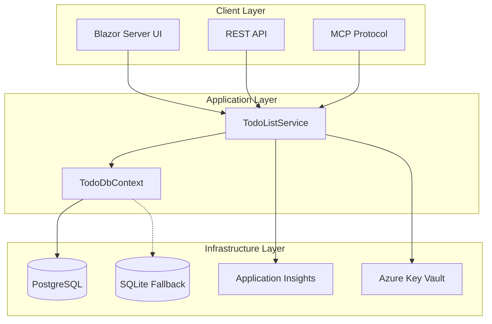
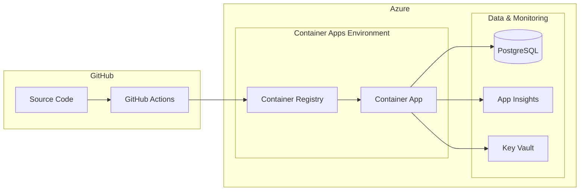

# TodoList - Modern .NET Blazor Application

[](https://github.com/YOUR_ORG/TodoList/actions/workflows/deploy.yml)
[](https://opensource.org/licenses/MIT)
[](https://dotnet.microsoft.com/download/dotnet/9.0)

A production-ready TodoList application built with .NET 9 Blazor Server, PostgreSQL, and Azure Container Apps. Features modern architecture with MCP (Model Context Protocol) integration for AI tool compatibility.

## 🚀 Features

### Core Functionality
- **Interactive Blazor Server UI**: Real-time updates with server-side rendering
- **PostgreSQL Database**: Production-ready persistence with automatic SQLite fallback
- **MCP Protocol Support**: Full AI assistant integration with JSON-RPC 2.0
- **RESTful API**: Clean HTTP endpoints for external integrations
- **Health Monitoring**: Comprehensive health checks with detailed status reporting

### DevOps & Infrastructure
- **Container-First**: Docker and Docker Compose ready
- **Azure Native**: Optimized for Azure Container Apps and managed services
- **CI/CD Pipeline**: GitHub Actions with Bicep Infrastructure as Code
- **Environment Management**: Dev, staging, and production configurations
- **Security First**: OIDC authentication, managed identities, and Key Vault integration

### Developer Experience
- **Structured Logging**: Application Insights integration with correlation IDs
- **Error Handling**: Comprehensive exception handling with detailed diagnostics
- **Performance Optimized**: Async-first architecture with connection pooling
- **Modern C#**: .NET 9 features with nullable reference types and records

## 🏗️ Architecture Overview



## 🚀 Quick Start

### Prerequisites

- **.NET 9 SDK** - [Download here](https://dotnet.microsoft.com/download/dotnet/9.0)
- **Docker** (optional) - [Download here](https://docs.docker.com/get-docker/)
- **PostgreSQL** (optional for local dev) - [Download here](https://www.postgresql.org/download/)

### Option 1: Docker Compose (Recommended)

```bash
# Clone the repository
git clone https://github.com/YOUR_ORG/TodoList.git
cd TodoList

# Start services (PostgreSQL + Application)
docker-compose up -d

# View logs
docker-compose logs -f todolist-app

# Access the application
# 🌐 Web UI: http://localhost:8080
# 🏥 Health: http://localhost:8080/health
# 🔧 MCP API: http://localhost:8080/mcp/todos
```

### Option 2: Local Development

```bash
# Clone and restore dependencies
git clone https://github.com/YOUR_ORG/TodoList.git
cd TodoList
dotnet restore

# Run with SQLite fallback (no PostgreSQL required)
dotnet run

# Or run with local PostgreSQL
# Set connection string in appsettings.Development.json
dotnet run --environment Development

# Access the application
# 🌐 Web UI: http://localhost:5000
# 🏥 Health: http://localhost:5000/health
# 🔧 MCP API: http://localhost:5000/mcp/todos
```

## 📋 API Reference

### Health Check
```http
GET /health
```
Returns detailed application health status including database connectivity.

### REST API Endpoints

#### Get All Todos
```http
GET /mcp/todos
Content-Type: application/json

Response:
{
  "todos": [...],
  "count": 5,
  "completedCount": 2
}
```

#### Add Todo
```http
POST /mcp/todos
Content-Type: application/json

{
  "title": "Learn Blazor",
  "isDone": false
}
```

#### Update Todo Status
```http
PUT /mcp/todos/{title}
Content-Type: application/json

{
  "isDone": true
}
```

#### Delete Todo
```http
DELETE /mcp/todos/{title}
```

### MCP Protocol

The application supports full MCP (Model Context Protocol) integration:

```http
POST /mcp
Content-Type: application/json

{
  "jsonrpc": "2.0",
  "id": 1,
  "method": "tools/call",
  "params": {
    "name": "add_todo",
    "arguments": {
      "title": "Learn MCP",
      "isDone": false
    }
  }
}
```

**Supported MCP Tools:**
- `get_todos` - Retrieve all todo items
- `add_todo` - Add a new todo item
- `remove_todo` - Remove todo by title
- `mark_todo_done` - Update completion status

## 🛠️ Development

### Project Structure

```
TodoList/
├── Components/                 # Blazor components
│   ├── Layout/                # Application layout
│   └── Pages/                 # Page components
├── Data/                      # Data access layer
│   └── TodoDbContext.cs       # Entity Framework context
├── Models/                    # Domain models
│   └── TodoItem.cs           # Todo entity
├── Services/                  # Business logic
│   └── TodoListService.cs    # Todo operations
├── infra/                     # Azure infrastructure
│   ├── main.bicep            # Main Bicep template
│   └── main-simple.bicep     # Simplified deployment
├── .github/workflows/         # CI/CD pipelines
├── docs/                      # Documentation
└── docker-compose.yml        # Local development
```

### Configuration

The application uses a layered configuration approach:

| File | Purpose | Environment |
|------|---------|-------------|
| `appsettings.json` | Base configuration | All |
| `appsettings.Development.json` | Development overrides | Local dev |
| `appsettings.Production.json` | Production settings | Azure |

#### Key Configuration Sections

```json
{
  "ConnectionStrings": {
    "DefaultConnection": "PostgreSQL connection string",
    "SqliteConnection": "SQLite fallback"
  },
  "Database": {
    "Provider": "PostgreSQL",
    "SeedData": true
  },
  "ApplicationInsights": {
    "ConnectionString": "App Insights connection"
  }
}
```

### Database Schema

```sql
-- TodoItems table
CREATE TABLE TodoItems (
    Id SERIAL PRIMARY KEY,
    Title VARCHAR(500) NOT NULL,
    IsDone BOOLEAN DEFAULT FALSE,
    CreatedAt TIMESTAMP DEFAULT CURRENT_TIMESTAMP,
    UpdatedAt TIMESTAMP
);

-- Indexes for performance
CREATE INDEX IX_TodoItems_Title ON TodoItems(Title);
CREATE INDEX IX_TodoItems_IsDone ON TodoItems(IsDone);
CREATE INDEX IX_TodoItems_CreatedAt ON TodoItems(CreatedAt);
```

### Running Tests

```bash
# Run all tests
dotnet test

# Run with coverage
dotnet test --collect:"XPlat Code Coverage"

# Integration tests (requires running database)
dotnet test --filter Category=Integration
```

## 🚀 Azure Deployment

### Prerequisites

1. **Azure Subscription** with appropriate permissions
2. **GitHub Repository** with the TodoList code
3. **Service Principal** or **Managed Identity** configured

### Deployment Architecture



### Setup Steps

#### 1. Configure GitHub Secrets

Set up the following repository secrets:

```bash
AZURE_CLIENT_ID=your-client-id
AZURE_TENANT_ID=your-tenant-id  
AZURE_SUBSCRIPTION_ID=your-subscription-id
```

#### 2. Deploy Infrastructure

The deployment uses Bicep templates with the following resources:

- **Azure Container Apps Environment** - Serverless container platform
- **Azure Container Registry** - Private image registry
- **Azure Database for PostgreSQL** - Managed database
- **Azure Application Insights** - APM and logging
- **Azure Key Vault** - Secrets management
- **Azure Log Analytics** - Centralized logging

#### 3. Trigger Deployment

```bash
# Automatic deployment on push to main
git push origin main

# Manual deployment with environment selection
# Use GitHub UI to trigger workflow_dispatch
```

#### 4. Monitor Deployment

```bash
# View deployment status
az containerapp logs show \
  --name todolist-app-dev \
  --resource-group rg-todolist-dev \
  --follow

# Check application health
curl https://your-app-url/health
```

### Environment Management

| Environment | Trigger | Approval | Database Tier |
|------------|---------|----------|---------------|
| **dev** | Push to main | ❌ | Burstable B1ms |
| **staging** | Manual dispatch | ❌ | General Purpose D2s |
| **prod** | Manual dispatch | ✅ | General Purpose D4s |

### Cost Optimization

The deployment is optimized for cost:

- **Container Apps**: Consumption-based pricing with scale-to-zero
- **Database**: Burstable tier for dev, optimized for production
- **Monitoring**: Basic tier Application Insights
- **Auto-scaling**: Based on CPU and HTTP requests

## 📊 Monitoring & Observability

### Health Checks

The application includes comprehensive health checks:

```csharp
// Database connectivity
builder.Services.AddHealthChecks()
    .AddDbContextCheck<TodoDbContext>("database")
    .AddCheck("self", () => HealthCheckResult.Healthy());
```

### Application Insights Integration

```csharp
// Structured logging with correlation
logger.LogInformation(
    "Todo item {TodoId} updated by {UserId} at {Timestamp}",
    todo.Id, userId, DateTime.UtcNow);
```

### Custom Metrics

- **Todo Operations**: Add, update, delete operations
- **API Response Times**: Track endpoint performance  
- **Database Query Performance**: Monitor slow queries
- **Error Rates**: Track application exceptions

### Dashboards

Key metrics are available in Azure Portal:
- Application performance trends
- Database connection health
- Container resource utilization
- User activity patterns

## 🔒 Security

### Authentication & Authorization

- **OIDC Integration**: Keyless authentication with GitHub Actions
- **Managed Identity**: Azure resources access without secrets
- **Key Vault**: Centralized secrets management
- **Network Security**: Private endpoints and firewall rules

### Data Protection

- **Encryption in Transit**: TLS 1.2+ for all connections
- **Encryption at Rest**: Azure-managed keys for database
- **Connection Security**: PostgreSQL SSL mode required
- **Input Validation**: Comprehensive validation on all inputs

### Best Practices Implemented

- ✅ No hardcoded secrets or connection strings
- ✅ Principle of least privilege for Azure roles
- ✅ Network isolation with virtual networks
- ✅ Secure container images with non-root users
- ✅ Regular dependency updates and security scanning

## 🛠️ Troubleshooting

### Common Issues

#### Application Won't Start
```bash
# Check container logs
docker-compose logs todolist-app

# Check database connection
docker-compose exec postgresql psql -U admin -d todolistdb -c "SELECT 1;"
```

#### Database Connection Issues
```bash
# Test PostgreSQL connectivity
az postgres flexible-server connect \
  --name your-server \
  --admin-user admin \
  --admin-password password

# Check firewall rules
az postgres flexible-server firewall-rule list \
  --name your-server \
  --resource-group your-rg
```

#### Azure Deployment Issues
```bash
# Check container app logs
az containerapp logs show \
  --name your-app \
  --resource-group your-rg \
  --follow

# Verify image in ACR
az acr repository show-tags \
  --name your-acr \
  --repository todolist
```

### Debug Commands

```bash
# Local debugging
dotnet run --verbosity detailed

# Container debugging  
docker exec -it todolist-app /bin/bash

# Azure diagnostics
az containerapp exec \
  --name your-app \
  --resource-group your-rg \
  --command /bin/bash
```

## 📚 Additional Resources

### Documentation
- 📖 [Deployment Best Practices](docs/deployment-bestpractices.md)
- 🏗️ [Azure Architecture Guide](https://docs.microsoft.com/en-us/azure/container-apps/)
- 🔧 [Bicep Templates](https://docs.microsoft.com/en-us/azure/azure-resource-manager/bicep/)

### Learning Resources
- [Blazor Server Tutorial](https://docs.microsoft.com/en-us/aspnet/core/blazor/)
- [Entity Framework Core](https://docs.microsoft.com/en-us/ef/core/)
- [Azure Container Apps](https://docs.microsoft.com/en-us/azure/container-apps/)
- [GitHub Actions](https://docs.github.com/en/actions)

## 🤝 Contributing

1. Fork the repository
2. Create a feature branch (`git checkout -b feature/amazing-feature`)
3. Commit your changes (`git commit -m 'Add amazing feature'`)
4. Push to the branch (`git push origin feature/amazing-feature`)
5. Open a Pull Request

### Development Standards

- ✅ Follow C# coding conventions
- ✅ Add unit tests for new features
- ✅ Update documentation for changes
- ✅ Ensure all health checks pass
- ✅ Test both PostgreSQL and SQLite paths

## 📄 License

This project is licensed under the MIT License - see the [LICENSE](LICENSE) file for details.

## 🙏 Acknowledgments

- Built with [.NET 9](https://dotnet.microsoft.com/) and [Blazor](https://blazor.net/)
- Infrastructure powered by [Azure Container Apps](https://azure.microsoft.com/services/container-apps/)
- CI/CD with [GitHub Actions](https://github.com/features/actions)
- Database by [PostgreSQL](https://www.postgresql.org/)

---

**Made with ❤️ for modern cloud-native development**

*For questions, issues, or contributions, please visit our [GitHub repository](https://github.com/YOUR_ORG/TodoList).*
- Azure CLI installed locally

#### Setup OIDC Authentication

**Windows (PowerShell):**
```powershell
.\scripts\setup-azure-oidc.ps1 -GitHubOrg "your-org" -GitHubRepo "your-repo"
```

**Linux/macOS:**
```bash
chmod +x scripts/setup-azure-oidc.sh
./scripts/setup-azure-oidc.sh
```

#### Configure GitHub Repository

1. Go to your GitHub repository settings
2. Navigate to "Secrets and variables" > "Actions" > "Variables"
3. Add the following repository variables:

| Variable Name | Value | Description |
|---------------|-------|-------------|
| `AZURE_CLIENT_ID` | `<from setup script>` | Azure AD Application ID |
| `AZURE_TENANT_ID` | `<your tenant ID>` | Azure AD Tenant ID |
| `AZURE_SUBSCRIPTION_ID` | `<your subscription ID>` | Azure Subscription ID |
| `AZURE_LOCATION` | `eastus` | Azure region for deployment |

4. Add the following repository secret:
   - `POSTGRES_ADMIN_PASSWORD`: Secure password for PostgreSQL admin user

#### Deploy

Push to the `main` branch to trigger automatic deployment:

```bash
git add .
git commit -m "Deploy TodoList to Azure"
git push origin main
```

Or trigger manual deployment from GitHub Actions tab.

## API Endpoints

### Health Check
- `GET /health` - Application health status

### REST API
- `GET /mcp/todos` - Get all todos
- `POST /mcp/todos` - Add new todo
- `PUT /mcp/todos/{title}` - Update todo status
- `DELETE /mcp/todos/{title}` - Remove todo

### MCP Protocol
- `POST /mcp` - MCP protocol endpoint for AI tool integration

## Database Setup

### PostgreSQL (Docker)
The PostgreSQL database is automatically initialized with Docker Compose.

### Manual PostgreSQL Setup
If you want to set up PostgreSQL manually:

```bash
# Run the setup script
./setup-database.ps1
```

### SQLite Fallback
The application automatically falls back to SQLite if PostgreSQL is not available.

## Configuration

### Connection Strings
- **PostgreSQL**: `Host=localhost;Database=todolistdb;Username=admin;Password=password`
- **SQLite**: `Data Source=todolist.db`

### Environment Variables
- `ASPNETCORE_ENVIRONMENT`: Set to `Development` or `Production`
- `ConnectionStrings__DefaultConnection`: Override default connection string

## Architecture

### Application Structure
- **Program.cs**: Clean, modular configuration with separated concerns
- **TodoDbContext.cs**: Entity Framework Core database context
- **TodoListService.cs**: Async-only business logic and data access layer
- **TodoItem.cs**: Data model with EF Core attributes
- **Components/**: Blazor components and pages

### Azure Architecture
- **Azure Container Apps**: Serverless container hosting with auto-scaling
- **Azure PostgreSQL Flexible Server**: Managed database service
- **Azure Container Registry**: Private container image storage
- **Azure Key Vault**: Secure secrets management
- **Azure Log Analytics**: Centralized logging and monitoring
- **Application Insights**: Application performance monitoring
- **Managed Identity**: Secure service-to-service authentication

### Key Features
- ✅ **Simplified Architecture**: Single app instance serving both web UI and MCP endpoints
- ✅ **Async-First**: All database operations are async for better performance
- ✅ **Clean Separation**: Modular Program.cs with clear separation of concerns
- ✅ **RESTful API**: Modern HTTP endpoints following REST conventions
- ✅ **Proper Error Handling**: Comprehensive error handling with logging
- ✅ **Docker Optimized**: Single port (8080) for all services
- ✅ **Health Monitoring**: Enhanced health checks with environment info
- ✅ **CI/CD Pipeline**: Automated deployment with GitHub Actions
- ✅ **Infrastructure as Code**: Bicep templates for reproducible deployments
- ✅ **Secure Deployment**: OIDC authentication, managed identities, Key Vault

## Technology Stack

- .NET 9
- Blazor Server
- Entity Framework Core
- PostgreSQL / SQLite
- Docker & Docker Compose
- MCP (Model Context Protocol)
- Azure Container Apps
- Azure PostgreSQL
- GitHub Actions
- Bicep (Infrastructure as Code)

## Development

### Building
```bash
dotnet build
```

### Docker
```bash
# Start services
docker-compose up -d

# View logs
docker-compose logs -f

# Stop services
docker-compose down
```

### Azure Development
```bash
# Deploy infrastructure only
az deployment group create \
  --resource-group rg-todolist-dev \
  --template-file infra/main.bicep \
  --parameters @infra/main.parameters.json

# Build and push container
az acr build --registry <acr-name> --image todolist-app:latest .
```

## Troubleshooting

### Local Development Issues

#### Database Connection Issues
1. Ensure PostgreSQL is running: `docker-compose ps`
2. Check connection string in `appsettings.json`
3. Application automatically falls back to SQLite if PostgreSQL is unavailable

#### Port Conflicts
- Default ports: 8080 (web + MCP), 5432 (PostgreSQL)
- Modify `docker-compose.yml` to change port mappings

#### Container Issues
```bash
# Rebuild containers
docker-compose down
docker-compose build --no-cache
docker-compose up -d
```

### Azure Deployment Issues

#### Authentication Errors
- Verify OIDC federated credentials are configured correctly
- Check GitHub repository variables and secrets
- Ensure Azure CLI permissions

#### Container Image Issues
- Check Azure Container Registry permissions
- Verify managed identity has AcrPull role
- Review GitHub Actions build logs

#### Application Runtime Issues
- Check Application Insights for errors
- Review Container Apps logs: `az containerapp logs show --name <app-name> --resource-group <rg-name>`
- Verify Key Vault access and secrets

## Monitoring

### Azure Resources
After deployment, monitor your application through:
- **Azure Portal**: Container Apps, PostgreSQL, Key Vault
- **Application Insights**: Performance and error tracking
- **Log Analytics**: Centralized logging

### Local Monitoring
- Health endpoint: `/health`
- Docker logs: `docker-compose logs -f`
- Application logs in console output

## Cost Optimization

### Development Environment
- Container Apps: ~$5-10/month (minimal usage)
- PostgreSQL: ~$15-30/month (Burstable tier)
- Storage & networking: ~$5/month
- **Total**: ~$25-45/month

### Production Environment
- Container Apps: ~$50-100/month (auto-scaling)
- PostgreSQL: ~$100-200/month (General Purpose)
- Storage & networking: ~$20/month
- **Total**: ~$170-320/month

## License

This project is licensed under the MIT License.
- `POST /mcp/todos` - Add new todo
- `PUT /mcp/todos/{title}` - Update todo status
- `DELETE /mcp/todos/{title}` - Remove todo

### MCP Protocol
- `POST /mcp` - MCP protocol endpoint for AI tool integration

## Database Setup

### PostgreSQL (Docker)
The PostgreSQL database is automatically initialized with Docker Compose.

### Manual PostgreSQL Setup
If you want to set up PostgreSQL manually:

```bash
# Run the setup script
./setup-database.ps1
```

### SQLite Fallback
The application automatically falls back to SQLite if PostgreSQL is not available.

## Configuration

### Connection Strings
- **PostgreSQL**: `Host=localhost;Database=todolistdb;Username=admin;Password=password`
- **SQLite**: `Data Source=todolist.db`

### Environment Variables
- `ASPNETCORE_ENVIRONMENT`: Set to `Development` or `Production`
- `ConnectionStrings__DefaultConnection`: Override default connection string

## Architecture

The application has been refactored for simplicity and maintainability:

- **Program.cs**: Clean, modular configuration with separated concerns
- **TodoDbContext.cs**: Entity Framework Core database context
- **TodoListService.cs**: Async-only business logic and data access layer
- **TodoItem.cs**: Data model with EF Core attributes
- **Components/**: Blazor components and pages

- ✅ **Simplified Architecture**: Single app instance serving both web UI and MCP endpoints
- ✅ **Async-First**: All database operations are async for better performance
- ✅ **Clean Separation**: Modular Program.cs with clear separation of concerns
- ✅ **RESTful API**: Modern HTTP endpoints following REST conventions
- ✅ **Proper Error Handling**: Comprehensive error handling with logging
- ✅ **Docker Optimized**: Single port (8080) for all services
- ✅ **Health Monitoring**: Enhanced health checks with environment info

### Map

TodoList/
├── .dockerignore
├── .gitignore  
├── .vscode/
│   └── mcp.json
├── appsettings.json
├── appsettings.Development.json
├── appsettings.Production.json
├── Components/
│   ├── App.razor
│   ├── Routes.razor
│   ├── _Imports.razor
│   ├── Layout/
│   │   ├── MainLayout.razor
│   │   └── MainLayout.razor.css
│   └── Pages/
│       ├── Error.razor
│       ├── Todo.razor
│       └── Todo.razor.css
├── database-setup.sql
├── docker-compose.yml
├── Dockerfile
├── Program.cs
├── Properties/
│   └── launchSettings.json
├── README.md
├── setup-database.ps1
├── TodoDbContext.cs
├── TodoItem.cs
├── TodoList.csproj
├── TodoList.sln
├── TodoListService.cs
└── wwwroot/
    ├── app.css
    └── favicon.png

## Technology Stack

- .NET 9
- Blazor Server
- Entity Framework Core
- PostgreSQL / SQLite
- Docker & Docker Compose
- MCP (Model Context Protocol)

## Development

### Building
```bash
dotnet build
```

### Docker
```bash
# Start services
docker-compose up -d

# View logs
docker-compose logs -f

# Stop services
docker-compose down
```

## Troubleshooting

### Database Connection Issues
1. Ensure PostgreSQL is running: `docker-compose ps`
2. Check connection string in `appsettings.json`
3. Application automatically falls back to SQLite if PostgreSQL is unavailable

### Port Conflicts
- Default ports: 8080 (web + MCP), 5432 (PostgreSQL)
- Modify `docker-compose.yml` to change port mappings

### Container Issues
```bash
# Rebuild containers
docker-compose down
docker-compose build --no-cache
docker-compose up -d
```

## License

This project is licensed under the MIT License.
# GitHub secrets configured - ready for deployment
# Testing secrets configuration - Tue Aug 12 00:36:53 PDT 2025
# OIDC federation configured Tue Aug 12 00:49:41 PDT 2025
# OIDC environment credentials configured Tue Aug 12 00:57:48 PDT 2025
