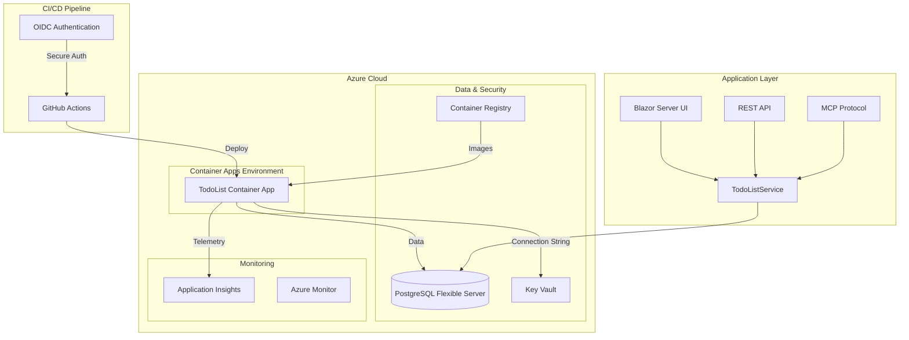

# TodoList - Modern .NET Blazor Application with Azure Cloud Deployment

[](https://opensource.org/licenses/MIT)
[](https://dotnet.microsoft.com/download/dotnet/9.0)
[](https://azure.microsoft.com/products/container-apps)
[](https://github.com/pakbaz/TodoList/actions/workflows/azure-dev.yml)

A modern TodoList application built with .NET 9 Blazor Server and PostgreSQL, featuring enterprise-grade Infrastructure as Code (IaC) and CI/CD pipeline deployment to Azure Container Apps.

## 🚀 Features

### Core Functionality

- **Interactive Blazor Server UI**: Real-time updates with server-side rendering
- **PostgreSQL Database**: Production-ready persistence with automatic SQLite fallback
- **MCP Protocol Support**: Full AI assistant integration with JSON-RPC 2.0
- **RESTful API**: Clean HTTP endpoints for external integrations
- **Health Monitoring**: Comprehensive health checks with detailed status reporting

### Cloud & DevOps

- **Azure Container Apps**: Serverless container hosting with auto-scaling
- **Infrastructure as Code**: Bicep templates with Azure Verified Modules
- **CI/CD Pipeline**: GitHub Actions with OIDC authentication and multi-environment deployment
- **Security**: Zero-secret architecture with managed identity and Key Vault integration
- **Monitoring**: Application Insights with custom telemetry and observability

### Developer Experience

- **Structured Logging**: Comprehensive logging with correlation IDs
- **Error Handling**: Comprehensive exception handling with detailed diagnostics
- **Performance Optimized**: Async-first architecture with connection pooling
- **Modern C#**: .NET 9 features with nullable reference types and records

## 🏗️ Architecture Overview


```mermaid
graph TB
    subgraph "Azure Cloud"
        subgraph "Container Apps Environment"
            APP[TodoList Container App]
        end
        
        subgraph "Data & Security"
            PG[(PostgreSQL Flexible Server)]
            KV[Key Vault]
            ACR[Container Registry]
        end
        
        subgraph "Monitoring"
            AI[Application Insights]
            MON[Azure Monitor]
        end
    end
    
    subgraph "CI/CD Pipeline"
        GH[GitHub Actions]
        OIDC[OIDC Authentication]
    end
    
    subgraph "Application Layer"
        UI[Blazor Server UI]
        API[REST API]
        MCP[MCP Protocol]
        SVC[TodoListService]
    end
    
    GH --> |Deploy| APP
    OIDC --> |Secure Auth| GH
    APP --> |Connection String| KV
    APP --> |Data| PG
    APP --> |Telemetry| AI
    ACR --> |Images| APP
    
    UI --> SVC
    API --> SVC
    MCP --> SVC
    SVC --> PG
```

## 🚀 Quick Start

### Azure Cloud Deployment (Recommended)

This application is configured for enterprise-grade deployment to Azure Container Apps with full Infrastructure as Code and CI/CD pipeline.

```bash
# Prerequisites: Azure CLI and GitHub account

# 1. Fork this repository to your GitHub account
# 2. Clone your fork locally
git clone https://github.com/YOUR_USERNAME/TodoList.git
cd TodoList

# 3. Initialize Azure Developer CLI
azd auth login
azd init

# 4. Deploy infrastructure and application
azd up

# The deployment will:
# ✅ Provision Azure Container Apps, PostgreSQL, Key Vault, and monitoring
# ✅ Build and deploy the containerized application
# ✅ Configure secure networking and managed identity authentication
# ✅ Set up CI/CD pipeline with GitHub Actions and OIDC

# 5. Access your deployed application
azd show --output table
```

**Deployed Services:**
- 🌐 **Web Application**: Your Container App URL (provided by azd)
- 🗄️ **Database**: Azure PostgreSQL Flexible Server with automatic backups
- 🔐 **Security**: Key Vault with managed identity authentication  
- 📊 **Monitoring**: Application Insights with custom telemetry
- 🚀 **CI/CD**: GitHub Actions with multi-environment deployment

### Local Development

#### Prerequisites

- **.NET 9 SDK** - [Download here](https://dotnet.microsoft.com/download/dotnet/9.0)
- **Docker** (optional) - [Download here](https://docs.docker.com/get-docker/)
- **PostgreSQL** (optional for local dev) - [Download here](https://www.postgresql.org/download/)

#### Option 1: Docker Compose (Recommended)

```bash
# Clone the repository
git clone https://github.com/YOUR_ORG/TodoList.git
cd TodoList

# Start services (PostgreSQL + Application)
docker-compose up -d

# View logs
docker-compose logs -f todolist-app

# Access the application
# 🌐 Web UI: http://localhost:8080
# 🏥 Health: http://localhost:8080/health
# 🔧 MCP API: http://localhost:8080/mcp/todos
```

### Option 2: Local Development

```bash
# Clone and restore dependencies
git clone https://github.com/YOUR_ORG/TodoList.git
cd TodoList
dotnet restore

# Run with SQLite fallback (no PostgreSQL required)
dotnet run

# Or run with local PostgreSQL
# Set connection string in appsettings.Development.json
dotnet run --environment Development

# Access the application
# 🌐 Web UI: http://localhost:5000
# 🏥 Health: http://localhost:5000/health
# 🔧 MCP API: http://localhost:5000/mcp/todos
```

## 📋 API Reference

### Health Check

```http
GET /health
```

Returns detailed application health status including database connectivity.

### REST API Endpoints

#### Get All Todos

```http
GET /mcp/todos
Content-Type: application/json

Response:
{
  "todos": [...],
  "count": 5,
  "completedCount": 2
}
```

#### Add Todo

```http
POST /mcp/todos
Content-Type: application/json

{
  "title": "Learn Blazor",
  "isDone": false
}
```

#### Update Todo Status

```http
PUT /mcp/todos/{title}
Content-Type: application/json

{
  "isDone": true
}
```

#### Delete Todo

```http
DELETE /mcp/todos/{title}
```

### MCP Protocol

The application supports full MCP (Model Context Protocol) integration:

```http
POST /mcp
Content-Type: application/json

{
  "jsonrpc": "2.0",
  "id": 1,
  "method": "tools/call",
  "params": {
    "name": "add_todo",
    "arguments": {
      "title": "Learn MCP",
      "isDone": false
    }
  }
}
```

**Supported MCP Tools:**

- `get_todos` - Retrieve all todo items
- `add_todo` - Add a new todo item
- `remove_todo` - Remove todo by title
- `mark_todo_done` - Update completion status

## 🛠️ Development

### Project Structure

```
TodoList/
├── Components/                 # Blazor components
│   ├── Layout/                # Application layout
│   └── Pages/                 # Page components
├── Data/                      # Data access layer
│   └── TodoDbContext.cs       # Entity Framework context
├── Models/                    # Domain models
│   └── TodoItem.cs           # Todo entity
├── Services/                  # Business logic
│   └── TodoListService.cs    # Todo operations
├── Tests/                     # Unit tests
├── Properties/                # Application settings
└── wwwroot/                   # Static web assets
```

### Configuration

The application uses a layered configuration approach:

| File | Purpose | Environment |
|------|---------|-------------|
| `appsettings.json` | Base configuration | All |
| `appsettings.Development.json` | Development overrides | Local dev |
| `appsettings.Production.json` | Production settings | Production |

#### Key Configuration Sections

```json
{
  "ConnectionStrings": {
    "DefaultConnection": "PostgreSQL connection string",
    "SqliteConnection": "SQLite fallback"
  },
  "Database": {
    "Provider": "PostgreSQL",
    "SeedData": true
  }
}
```

### Database Schema

```sql
-- TodoItems table
CREATE TABLE TodoItems (
    Id SERIAL PRIMARY KEY,
    Title VARCHAR(500) NOT NULL,
    IsDone BOOLEAN DEFAULT FALSE,
    CreatedAt TIMESTAMP DEFAULT CURRENT_TIMESTAMP,
    UpdatedAt TIMESTAMP
);

-- Indexes for performance
CREATE INDEX IX_TodoItems_Title ON TodoItems(Title);
CREATE INDEX IX_TodoItems_IsDone ON TodoItems(IsDone);
CREATE INDEX IX_TodoItems_CreatedAt ON TodoItems(CreatedAt);
```

### Running Tests

```bash
# Run all tests
dotnet test

# Run with coverage
dotnet test --collect:"XPlat Code Coverage"

# Integration tests (requires running database)
dotnet test --filter Category=Integration
```

## 🛠️ Local Development

### Building

```bash
dotnet build
```

### Docker

```bash
# Start services
docker-compose up -d

# View logs
docker-compose logs -f

# Stop services
docker-compose down
```

## 🛠️ Troubleshooting

### Common Issues

#### Database Connection Issues

1. Ensure PostgreSQL is running: `docker-compose ps`
2. Check connection string in `appsettings.json`
3. Application automatically falls back to SQLite if PostgreSQL is unavailable

#### Port Conflicts

- Default ports: 8080 (web + MCP), 5432 (PostgreSQL)
- Modify `docker-compose.yml` to change port mappings

#### Container Issues

```bash
# Rebuild containers
docker-compose down
docker-compose build --no-cache
docker-compose up -d
```

### Debug Commands

```bash
# Local debugging
dotnet run --verbosity detailed

# Container debugging  
docker exec -it todolist-app /bin/bash
```

## 📚 Additional Resources

### Learning Resources

- [Blazor Server Tutorial](https://docs.microsoft.com/en-us/aspnet/core/blazor/)
- [Entity Framework Core](https://docs.microsoft.com/en-us/ef/core/)
- [PostgreSQL Documentation](https://www.postgresql.org/docs/)

## 🤝 Contributing

1. Fork the repository
2. Create a feature branch (`git checkout -b feature/amazing-feature`)
3. Commit your changes (`git commit -m 'Add amazing feature'`)
4. Push to the branch (`git push origin feature/amazing-feature`)
5. Open a Pull Request

### Development Standards

- ✅ Follow C# coding conventions
- ✅ Add unit tests for new features
- ✅ Update documentation for changes
- ✅ Ensure all health checks pass
- ✅ Test both PostgreSQL and SQLite paths

## Technology Stack

- .NET 9
- Blazor Server
- Entity Framework Core
- PostgreSQL / SQLite
- Docker & Docker Compose
- MCP (Model Context Protocol)

## 📄 License

This project is licensed under the MIT License - see the [LICENSE](LICENSE) file for details.

## 🙏 Acknowledgments

- Built with [.NET 9](https://dotnet.microsoft.com/) and [Blazor](https://blazor.net/)
- Database by [PostgreSQL](https://www.postgresql.org/)
- Containerized with [Docker](https://www.docker.com/)

---

**Made with ❤️ for modern development**

*For questions, issues, or contributions, please visit our [GitHub repository](https://github.com/YOUR_ORG/TodoList).*
