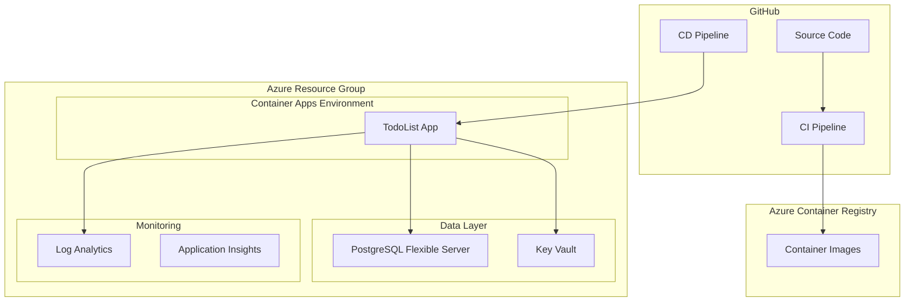

# DevOps Documentation - TodoList Application

## Overview

This document describes the Azure Infrastructure as Code (IaC) and CI/CD setup for the TodoList ASP.NET Core application. The solution uses Azure Container Apps for hosting, PostgreSQL for data storage, and GitHub Actions for automated deployment.

## Architecture

### High-Level Architecture



### Azure Resources

| Resource Type | Purpose | SKU/Tier |
|---------------|---------|----------|
| Container Apps Environment | Application hosting | Consumption |
| Container App | TodoList application | 0.25 CPU, 512Mi RAM |
| PostgreSQL Flexible Server | Database | Standard_B1ms |
| Azure Container Registry | Container images | Basic |
| Key Vault | Secrets management | Standard |
| Log Analytics | Centralized logging | Pay-as-you-go |

## Infrastructure Components

### Bicep Modules

The infrastructure is defined using modular Bicep templates:

- **`main.bicep`**: Main orchestrator that deploys all resources
- **`modules/log-analytics.bicep`**: Log Analytics workspace
- **`modules/keyvault.bicep`**: Azure Key Vault for secrets
- **`modules/acr.bicep`**: Azure Container Registry with managed identity
- **`modules/postgresql.bicep`**: PostgreSQL server with database
- **`modules/aca-env.bicep`**: Container Apps environment
- **`modules/aca-app.bicep`**: Container app with scaling rules

### Security Features

1. **Managed Identities**: System-assigned identities for service-to-service authentication
2. **Key Vault Integration**: Secrets stored securely and referenced by container app
3. **RBAC**: Role-based access control for all Azure resources
4. **HTTPS Only**: Enforced HTTPS for all ingress traffic
5. **Network Security**: Azure-managed networking with optional VNet integration

## CI/CD Pipelines

### Continuous Integration (CI)

**Trigger**: Pull requests and pushes to feature branches
**File**: `.github/workflows/ci.yml`

**Steps**:
1. **Build & Test**: .NET build and unit test execution
2. **Container Build**: Docker image build and push to ACR
3. **Security Scanning**: Automated vulnerability scanning
4. **Artifact Attestation**: Generate build provenance

**Outputs**:
- Container image tagged with commit SHA
- Test results and coverage reports
- Security scan results

### Continuous Deployment (CD)

**Trigger**: Push to main branch or manual dispatch
**File**: `.github/workflows/cd.yml`

**Environments**:
- **Development**: Auto-deploy from main branch
- **Staging**: Manual deployment with approval
- **Production**: Manual deployment with enhanced verification

**Steps**:
1. **Infrastructure Deployment**: Bicep template deployment
2. **Application Deployment**: Container app update with new image
3. **Health Verification**: Automated health checks
4. **Smoke Tests**: Basic functionality verification

## Environment Configuration

### Development Environment

```json
{
  "environment": "dev",
  "resourceGroup": "todolist-rg-dev",
  "containerRegistry": "todolistacrdev",
  "autoScale": {
    "minReplicas": 1,
    "maxReplicas": 3
  }
}
```

### Production Environment

```json
{
  "environment": "prod",
  "resourceGroup": "todolist-rg-prod",
  "containerRegistry": "todolistacrprod",
  "autoScale": {
    "minReplicas": 2,
    "maxReplicas": 10
  }
}
```

## Secrets and Configuration Management

### GitHub Repository Secrets

| Secret Name | Description | Environment |
|-------------|-------------|-------------|
| `AZURE_CLIENT_ID` | Azure service principal client ID | All |
| `AZURE_TENANT_ID` | Azure tenant ID | All |
| `AZURE_SUBSCRIPTION_ID` | Azure subscription ID | All |
| `POSTGRESQL_ADMIN_PASSWORD` | Database admin password | Environment-specific |

### GitHub Repository Variables

| Variable Name | Description | Example |
|---------------|-------------|---------|
| `ACR_NAME` | Container registry name | `todolistacrdev` |
| `AZURE_LOCATION` | Azure region | `East US` |
| `POSTGRESQL_ADMIN_LOGIN` | Database admin username | `todolistadmin` |

### Azure Key Vault Secrets

| Secret Name | Description | Used By |
|-------------|-------------|---------|
| `postgresql-connection-string` | Full database connection string | Container App |
| `postgresql-host` | Database server hostname | Container App |
| `postgresql-database` | Database name | Container App |
| `postgresql-username` | Database username | Container App |
| `postgresql-password` | Database password | Container App |

## Deployment Process

### Initial Setup

1. **Azure Resources**: Create resource groups and service principal
2. **GitHub Configuration**: Set up repository secrets and variables
3. **OIDC Configuration**: Configure federated credentials
4. **First Deployment**: Run infrastructure deployment

### Regular Deployments

1. **Code Changes**: Push code to feature branch
2. **CI Pipeline**: Automated build, test, and container creation
3. **Pull Request**: Code review and merge to main
4. **CD Pipeline**: Automated deployment to development
5. **Manual Promotion**: Deploy to staging/production as needed

## Monitoring and Observability

### Application Monitoring

- **Health Endpoints**: `/health` endpoint for Container Apps health probes
- **Application Insights**: Performance monitoring and error tracking
- **Custom Metrics**: Business metrics and application telemetry

### Infrastructure Monitoring

- **Log Analytics**: Centralized logging for all Azure resources
- **Container Apps Logs**: Application logs and system events
- **Database Monitoring**: PostgreSQL performance and availability

### Alerting

- **Health Check Failures**: Alert on application unavailability
- **Resource Utilization**: CPU, memory, and storage alerts
- **Error Rate**: Application error rate thresholds
- **Security Events**: Key Vault access and authentication failures

## Scaling and Performance

### Auto-scaling Configuration

```yaml
scale:
  minReplicas: 1
  maxReplicas: 5
  rules:
    - name: http-rule
      http:
        metadata:
          concurrentRequests: '100'
    - name: cpu-rule
      custom:
        type: cpu
        metadata:
          type: Utilization
          value: '70'
```

### Performance Optimization

- **Connection Pooling**: PostgreSQL connection pool configuration
- **Caching**: Application-level caching strategies
- **Image Optimization**: Multi-stage Docker builds
- **Resource Allocation**: Right-sized CPU and memory allocations

## Disaster Recovery and Backup

### Database Backup

- **Automated Backups**: Daily PostgreSQL backups with 7-day retention
- **Point-in-Time Recovery**: Restore to any point within retention period
- **Cross-Region Backup**: Geo-redundant backups for production

### Application Recovery

- **Container Apps Revisions**: Blue-green deployment with instant rollback
- **Infrastructure Recovery**: IaC-based infrastructure recreation
- **Configuration Recovery**: Key Vault backup and restore

## Security Considerations

### Authentication and Authorization

- **OIDC**: Passwordless authentication from GitHub to Azure
- **Managed Identity**: Service-to-service authentication
- **RBAC**: Least-privilege access control

### Network Security

- **HTTPS Enforcement**: All traffic encrypted in transit
- **Private Endpoints**: Database access through private network
- **Firewall Rules**: Restricted database access

### Data Protection

- **Encryption at Rest**: Azure-managed encryption for all data
- **Encryption in Transit**: TLS 1.2+ for all communications
- **Secret Management**: Azure Key Vault for sensitive data

## Troubleshooting Guide

### Common Issues

1. **Container Startup Failures**
   - Check container logs in Azure portal
   - Verify environment variables and secrets
   - Validate database connectivity

2. **Database Connection Issues**
   - Verify firewall rules
   - Check connection string format
   - Validate credentials in Key Vault

3. **Deployment Failures**
   - Review GitHub Actions logs
   - Check Bicep template validation
   - Verify Azure permissions

### Debugging Commands

```bash
# Check container app status
az containerapp show --name todolist-app-dev --resource-group todolist-rg-dev

# View application logs
az containerapp logs show --name todolist-app-dev --resource-group todolist-rg-dev

# Test database connectivity
az postgres flexible-server show --name todolist-db-dev --resource-group todolist-rg-dev
```

## Cost Optimization

### Resource Right-Sizing

- Monitor CPU and memory utilization
- Adjust container app scaling rules
- Optimize database tier based on usage

### Cost Management

- Implement resource tagging for cost tracking
- Set up budget alerts
- Use Azure Cost Management recommendations

## Future Enhancements

### Phase 2 Improvements

1. **Enhanced Security**
   - VNet integration with private endpoints
   - Application Gateway with WAF
   - Network Security Groups

2. **Advanced Monitoring**
   - Custom dashboards and alerts
   - Application Performance Monitoring (APM)
   - Distributed tracing

3. **Multi-Region Deployment**
   - Cross-region replication
   - Traffic Manager for load distribution
   - Disaster recovery automation

### Automation Improvements

- Automated security scanning
- Performance testing integration
- Infrastructure drift detection
- Automated rollback mechanisms
