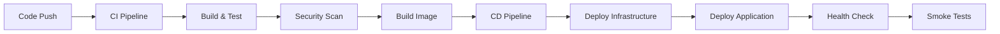

# DevOps Guide - TodoList Application

## Overview

This document provides comprehensive operational procedures for the TodoList application deployment and management on Azure Container Apps.

## Table of Contents

1. [Quick Start](#quick-start)
2. [Prerequisites](#prerequisites)
3. [GitHub Repository Setup](#github-repository-setup)
4. [Manual Deployment](#manual-deployment)
5. [CI/CD Pipeline](#cicd-pipeline)
6. [Environment Management](#environment-management)
7. [Monitoring and Troubleshooting](#monitoring-and-troubleshooting)
8. [Security](#security)
9. [Disaster Recovery](#disaster-recovery)
10. [Cost Optimization](#cost-optimization)

## Quick Start

### 1. Repository Setup

1. **Fork or clone the repository**
2. **Enable GitHub Actions** in your repository
3. **Configure repository secrets** (see [GitHub Repository Setup](#github-repository-setup))
4. **Push to main branch** to trigger automatic deployment to production

### 2. First Deployment

```bash
# Trigger manual deployment
gh workflow run cd.yml -f environment=dev -f image_tag=latest
```

## Prerequisites

### Azure Requirements

- **Azure Subscription** with appropriate permissions
- **Azure CLI** installed and configured
- **Bicep CLI** for infrastructure as code
- **Docker** for local development

### Local Development Setup

```bash
# Install .NET 9.0 SDK
dotnet --version  # Should be 9.0.x

# Install Azure CLI
az --version

# Install Bicep CLI
az bicep install

# Install Docker
docker --version
```

## GitHub Repository Setup

### Required Secrets

Configure the following secrets in your GitHub repository (`Settings > Secrets and variables > Actions`):

| Secret Name | Description | Example Value |
|-------------|-------------|---------------|
| `AZURE_CLIENT_ID` | Azure service principal client ID | `12345678-1234-1234-1234-123456789012` |
| `AZURE_TENANT_ID` | Azure tenant ID | `87654321-4321-4321-4321-210987654321` |
| `AZURE_SUBSCRIPTION_ID` | Azure subscription ID | `abcdef12-3456-7890-abcd-ef1234567890` |
| `DATABASE_PASSWORD` | PostgreSQL database password | `SecurePassword123!` |

### Azure OIDC Setup

1. **Create Azure Service Principal**:

```bash
# Create service principal
az ad sp create-for-rbac \
  --name "sp-todolist-github" \
  --role contributor \
  --scopes /subscriptions/{subscription-id} \
  --json-auth

# Note the output values for GitHub secrets
```

1. **Configure OIDC Federation**:

```bash
# Create federated credential for main branch
az ad app federated-credential create \
  --id {app-id} \
  --parameters '{
    "name": "todolist-main",
    "issuer": "https://token.actions.githubusercontent.com",
    "subject": "repo:{owner}/{repo}:ref:refs/heads/main",
    "description": "Main branch deployment",
    "audiences": ["api://AzureADTokenExchange"]
  }'

# Create federated credential for develop branch
az ad app federated-credential create \
  --id {app-id} \
  --parameters '{
    "name": "todolist-develop",
    "issuer": "https://token.actions.githubusercontent.com",
    "subject": "repo:{owner}/{repo}:ref:refs/heads/develop",
    "description": "Develop branch deployment",
    "audiences": ["api://AzureADTokenExchange"]
  }'
```

## Manual Deployment

### Infrastructure Deployment

```bash
# Login to Azure
az login

# Create resource group
az group create \
  --name rg-todolist-dev \
  --location "East US"

# Deploy infrastructure
az deployment group create \
  --resource-group rg-todolist-dev \
  --template-file infra/main.bicep \
  --parameters infra/parameters/dev.bicepparam \
  --parameters imageTag=latest \
  --parameters databaseAdminPassword="YourSecurePassword123!"
```

### Manual Application Deployment

```bash
# Build and push image
az acr login --name {acr-name}
docker build -t {acr-name}.azurecr.io/todolist:latest .
docker push {acr-name}.azurecr.io/todolist:latest

# Update container app
az containerapp update \
  --name {container-app-name} \
  --resource-group rg-todolist-dev \
  --image {acr-name}.azurecr.io/todolist:latest
```

## CI/CD Pipeline

### Pipeline Architecture


```mermaid
graph LR
    A[Code Push] --> B[CI Pipeline]
    B --> C[Build & Test]
    C --> D[Security Scan]
    D --> E[Build Image]
    E --> F[CD Pipeline]
    F --> G[Deploy Infrastructure]
    G --> H[Deploy Application]
    H --> I[Health Check]
    I --> J[Smoke Tests]
```

### Workflow Triggers

| Branch | Environment | Trigger | Description |
|--------|-------------|---------|-------------|
| `main` | Production | Automatic | Production deployment |
| `develop` | Staging | Automatic | Staging deployment |
| `feature/*` | Dev | Manual | Feature testing |

### Application Deployment

```bash
# Deploy to specific environment
gh workflow run cd.yml -f environment=staging -f image_tag=v1.2.3

# View workflow status
gh run list --workflow=cd.yml
```

## Environment Management

### Environment Configuration

| Environment | Resource Group | Database | Scaling | Monitoring |
|-------------|----------------|----------|---------|------------|
| **Development** | `rg-todolist-dev` | SQLite | Single instance | Basic |
| **Staging** | `rg-todolist-staging` | PostgreSQL | 1-3 instances | Enhanced |
| **Production** | `rg-todolist-prod` | PostgreSQL | 2-10 instances | Full |

### Environment Variables

```bash
# Development
ASPNETCORE_ENVIRONMENT=Development
ConnectionStrings__DefaultConnection=Data Source=app.db

# Staging/Production
ASPNETCORE_ENVIRONMENT=Production
ConnectionStrings__DefaultConnection=Host={db-host};Database=todolist;Username={username};Password={password}
```

### Scaling Configuration

```bicep
// Development
scale: {
  minReplicas: 1
  maxReplicas: 1
}

// Staging
scale: {
  minReplicas: 1
  maxReplicas: 3
  rules: [
    {
      name: 'http-requests'
      http: {
        metadata: {
          concurrentRequests: '50'
        }
      }
    }
  ]
}

// Production
scale: {
  minReplicas: 2
  maxReplicas: 10
  rules: [
    {
      name: 'http-requests'
      http: {
        metadata: {
          concurrentRequests: '100'
        }
      }
    }
    {
      name: 'cpu-utilization'
      custom: {
        type: 'cpu'
        metadata: {
          type: 'Utilization'
          value: '70'
        }
      }
    }
  ]
}
```

## Monitoring and Troubleshooting

### Health Checks

```bash
# Application health
curl https://{app-fqdn}/health

# Detailed health check
curl https://{app-fqdn}/health | jq '.'
```

### Log Analysis

```bash
# View container app logs
az containerapp logs show \
  --name {container-app-name} \
  --resource-group {resource-group} \
  --follow

# View specific revision logs
az containerapp revision show \
  --name {revision-name} \
  --app {container-app-name} \
  --resource-group {resource-group}
```

### Application Insights Queries

```kusto
// Error rate by time
requests
| where timestamp > ago(1h)
| summarize ErrorRate = countif(success == false) * 100.0 / count() by bin(timestamp, 5m)
| render timechart

// Response time percentiles
requests
| where timestamp > ago(1h)
| summarize 
    P50 = percentile(duration, 50),
    P95 = percentile(duration, 95),
    P99 = percentile(duration, 99)
    by bin(timestamp, 5m)
| render timechart

// Exception analysis
exceptions
| where timestamp > ago(24h)
| summarize count() by type, bin(timestamp, 1h)
| render columnchart
```

### Common Issues

#### 1. Container App Not Starting

**Symptoms**: Deployment succeeds but app is not accessible

**Diagnosis**:
```bash
# Check container app status
az containerapp show --name {app-name} --resource-group {rg} --query 'properties.configuration.ingress'

# Check recent revisions
az containerapp revision list --name {app-name} --resource-group {rg}

# View logs
az containerapp logs show --name {app-name} --resource-group {rg} --tail 50
```

**Solutions**:
- Check image exists in ACR
- Verify environment variables
- Check health probe configuration
- Review application startup logs

#### 2. Database Connection Issues

**Symptoms**: Application starts but fails database operations

**Diagnosis**:
```bash
# Test database connectivity
az postgres flexible-server show --name {db-name} --resource-group {rg}

# Check connection string in Key Vault
az keyvault secret show --vault-name {kv-name} --name ConnectionStrings--DefaultConnection
```

**Solutions**:
- Verify database server is running
- Check firewall rules
- Validate connection string
- Review managed identity permissions

#### 3. High Response Times

**Symptoms**: Application responds slowly

**Diagnosis**:
```bash
# Check resource utilization
az containerapp show --name {app-name} --resource-group {rg} --query 'properties.template.scale'

# Review scaling rules
az monitor metrics list --resource {resource-id} --metric "Requests" --interval PT1M
```

**Solutions**:
- Increase replica count
- Optimize database queries
- Add caching layer
- Review scaling triggers

### Performance Monitoring

```bash
# CPU and Memory usage
az monitor metrics list \
  --resource "/subscriptions/{sub}/resourceGroups/{rg}/providers/Microsoft.App/containerApps/{app}" \
  --metric "CpuPercentage,MemoryPercentage" \
  --interval PT5M

# Request metrics
az monitor metrics list \
  --resource "/subscriptions/{sub}/resourceGroups/{rg}/providers/Microsoft.App/containerApps/{app}" \
  --metric "Requests,RequestsPerSecond" \
  --interval PT1M
```

## Security

### Security Checklist

- [ ] **OIDC Authentication**: GitHub Actions uses OIDC instead of service principal secrets
- [ ] **Managed Identity**: Container App uses managed identity for Azure service access
- [ ] **Key Vault**: All secrets stored in Azure Key Vault
- [ ] **Private Endpoints**: Database accessible only via private endpoints
- [ ] **Network Isolation**: Container Apps deployed in VNet
- [ ] **Image Scanning**: Container images scanned for vulnerabilities
- [ ] **HTTPS Only**: All traffic encrypted in transit
- [ ] **Database Encryption**: Database encrypted at rest

### Security Monitoring

```bash
# Check Key Vault access logs
az monitor diagnostic-settings list --resource {key-vault-resource-id}

# Review network security group logs
az network nsg show --name {nsg-name} --resource-group {rg}

# Container image vulnerability scan results
az acr repository show-vulnerabilities --name {acr-name} --repository todolist
```

### Security Updates

```bash
# Update base image
docker pull mcr.microsoft.com/dotnet/aspnet:9.0

# Rebuild and scan
docker build -t todolist:latest .
trivy image todolist:latest

# Update infrastructure
az deployment group create \
  --resource-group {rg} \
  --template-file infra/main.bicep \
  --parameters infra/parameters/prod.bicepparam
```

## Disaster Recovery

### Backup Strategy

1. **Database Backups**:
   - Automated daily backups (35-day retention)
   - Point-in-time recovery available
   - Cross-region backup replication

2. **Application State**:
   - Stateless application design
   - Configuration in Key Vault
   - Infrastructure as Code in Git

3. **Container Images**:
   - Images stored in Azure Container Registry
   - Geo-replication enabled
   - Image retention policy

### Recovery Procedures

#### 1. Database Recovery

```bash
# List available backups
az postgres flexible-server backup list \
  --server-name {db-name} \
  --resource-group {rg}

# Restore to point in time
az postgres flexible-server restore \
  --name {new-db-name} \
  --resource-group {rg} \
  --source-server {source-db-name} \
  --restore-time "2023-12-01T10:00:00Z"
```

#### 2. Application Recovery

```bash
# Rollback to previous image
az containerapp update \
  --name {app-name} \
  --resource-group {rg} \
  --image {acr-name}.azurecr.io/todolist:{previous-tag}

# Rollback via revision
az containerapp revision set-mode \
  --name {app-name} \
  --resource-group {rg} \
  --mode single \
  --revision {previous-revision}
```

#### 3. Infrastructure Recovery

```bash
# Redeploy infrastructure
az deployment group create \
  --resource-group {rg} \
  --template-file infra/main.bicep \
  --parameters infra/parameters/prod.bicepparam
```

### RTO/RPO Targets

| Environment | RTO (Recovery Time) | RPO (Data Loss) | SLA |
|-------------|-------------------|-----------------|-----|
| **Development** | 4 hours | 24 hours | 95% |
| **Staging** | 2 hours | 4 hours | 99% |
| **Production** | 1 hour | 1 hour | 99.9% |

## Cost Optimization

### Cost Monitoring

```bash
# View resource costs
az consumption usage list \
  --start-date 2023-12-01 \
  --end-date 2023-12-31 \
  --include-additional-properties \
  --include-meter-details

# Container Apps specific costs
az monitor metrics list \
  --resource {container-app-resource-id} \
  --metric "CpuTime,MemoryTime" \
  --interval PT1H
```

### Optimization Strategies

1. **Right-sizing**:
   - Monitor CPU/memory utilization
   - Adjust container resource limits
   - Optimize scaling rules

2. **Environment Management**:
   - Auto-shutdown dev environments
   - Use smaller SKUs for non-production
   - Implement cost alerts

3. **Database Optimization**:
   - Use appropriate PostgreSQL tier
   - Enable automatic backups optimization
   - Monitor storage usage

### Cost Alerts

```bash
# Create cost alert
az consumption budget create \
  --budget-name "todolist-monthly" \
  --amount 100 \
  --time-grain Monthly \
  --time-period start=2023-12-01 \
  --category Cost \
  --resource-group {rg}
```

## Maintenance

### Regular Tasks

#### Weekly
- [ ] Review Application Insights dashboards
- [ ] Check container app scaling metrics
- [ ] Verify backup completion
- [ ] Review security scan results

#### Monthly
- [ ] Update base container images
- [ ] Review and optimize resource costs
- [ ] Update infrastructure templates
- [ ] Security assessment

#### Quarterly
- [ ] Disaster recovery test
- [ ] Performance review and optimization
- [ ] Security audit
- [ ] Cost optimization review

### Maintenance Windows

| Environment | Window | Duration | Frequency |
|-------------|--------|----------|-----------|
| **Development** | Anytime | 30 minutes | As needed |
| **Staging** | Sunday 2-4 AM EST | 2 hours | Weekly |
| **Production** | Sunday 2-4 AM EST | 1 hour | Monthly |

## Support and Contacts

### Escalation Matrix

1. **Level 1**: Application Issues
   - GitHub Issues
   - Application logs review
   - Basic troubleshooting

2. **Level 2**: Infrastructure Issues
   - Azure support tickets
   - Infrastructure debugging
   - Performance optimization

3. **Level 3**: Critical Issues
   - Emergency response
   - Vendor escalation
   - Executive notification

### Useful Links

- [Application Insights Dashboard](https://portal.azure.com/#blade/AppInsightsExtension)
- [Azure Container Apps Documentation](https://docs.microsoft.com/en-us/azure/container-apps/)
- [PostgreSQL Flexible Server Documentation](https://docs.microsoft.com/en-us/azure/postgresql/flexible-server/)
- [GitHub Actions Documentation](https://docs.github.com/en/actions)

---

**Document Version**: 1.0  
**Last Updated**: 2023-12-01  
**Next Review**: 2024-03-01
